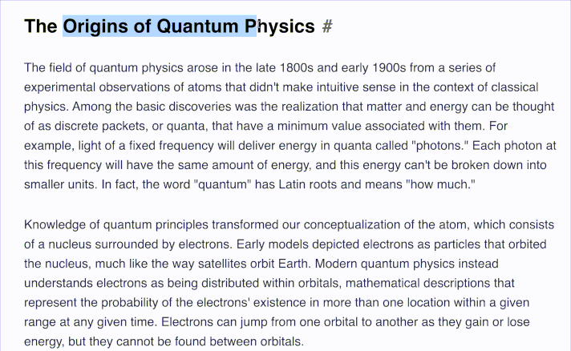
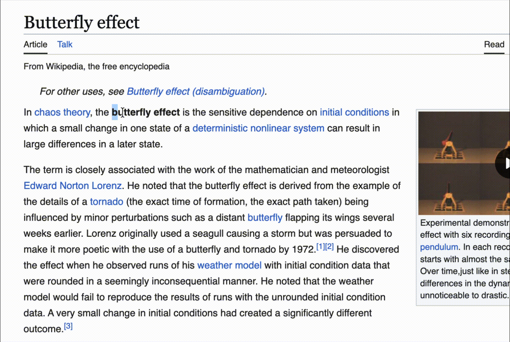

# Explain This

Select any text on a page, right-click, hit "Explain This," get a plain-language explanation. Runs entirely in your browser tab using a local LLM over WebGPU. No server, no API key, nothing ever leaves your machine.



## Why

I was messing around with Ollama and vLLM locally for privacy-sensitive stuff (translating docs, RAG over my own notes) and got curious about WebLLM, which runs models straight in the browser via WebGPU instead of needing a separate server process. It used to be pretty slow and limited. Turns out it's gotten a lot better lately, so I built this to actually test it on something real instead of just reading benchmarks.

## Requirements

Chrome or Edge, recent desktop version (needs WebGPU, which is Chrome 113+ roughly). Won't work on browsers without WebGPU support, and the extension will tell you that instead of just failing silently.

## First run

The first time you use it, it downloads the model (Llama 3.2 1B, quantized, about 880MB) and caches it in the browser. That happens once, you'll see a progress bar so it's obvious what's happening. While the extension keeps the model warm in memory, explanations are genuinely instant. If Chrome tears down the extension's background page (browser restart, extension update, long idle), the next explanation has to re-read the cached weights from disk and rebuild the WebGPU pipeline, which takes a few real seconds, not a re-download, but not instant either.

Known rough edge: right after a full browser restart, the very first explanation can occasionally take noticeably longer, or need a second try, while the offscreen document finishes a cold start. Not something you're doing wrong, and it resolves on its own; a fix for this specific case is on the list.



## Follow-up actions

Once an explanation finishes, a small row of buttons appears underneath it: **Regenerate** (a different phrasing of the same explanation), **Elaborate** (more detail), **Simplify** (shorter, less jargon), **Example** (adds a concrete example), and **Copy**. Each of the four generation buttons reruns the model with a different instruction rather than continuing an open-ended conversation, that keeps them fast and avoids the small model losing the thread over a long back-and-forth.

## Installing it (dev mode, Chrome Web Store listing is in review)

```bash
git clone https://github.com/Vishwamitra/explain-this.git
cd explain-this
npm install
npm run build
```

Then in Chrome: go to `chrome://extensions`, turn on Developer mode, click "Load unpacked," and point it at the `dist` folder.

## How it works

The tricky part of this project isn't the AI, it's Chrome's extension architecture. Manifest V3 background scripts are service workers, and service workers don't have access to WebGPU. So the model can't just live in the background script.

The fix is a `chrome.offscreen` document: a hidden page Chrome lets extensions spin up that has full DOM/WebGPU access, unlike a service worker. That's where the actual model lives and runs.

So the flow is:

1. You right-click selected text, the background script gets the selection and the tab id from Chrome directly
2. Background creates the offscreen document if it's not already running, and forwards the text to it
3. The offscreen document runs the model and streams tokens back
4. Background relays those streamed tokens to the content script in your tab, since the offscreen document has no way to talk to a tab directly
5. The content script renders them into a small popup near your selection

Three separate contexts talking to each other through `chrome.runtime` messages, because that's genuinely the only way to do this under MV3 right now.

## Changing the model

The model is a single constant in `src/shared/config.ts`. WebLLM supports a lot of models at different sizes, the one here is picked for a small first download, not necessarily the best quality. Swap it if you want something bigger/better and don't mind a longer first download.

## License

MIT, see [LICENSE](LICENSE).
